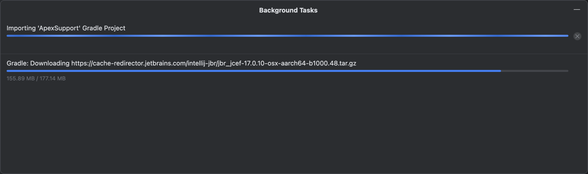
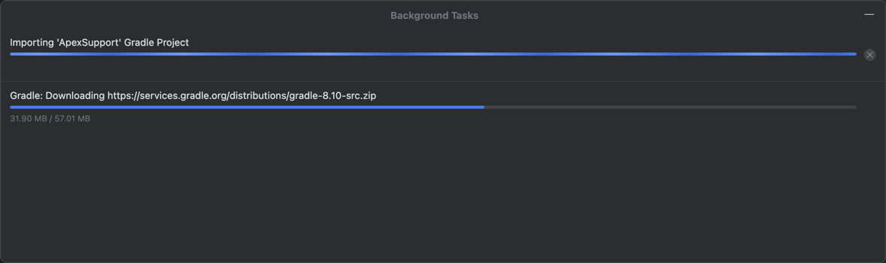
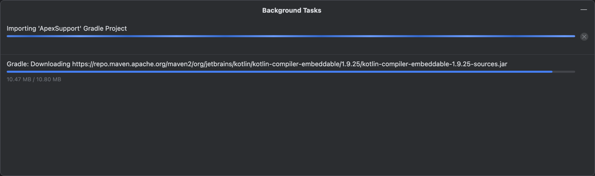
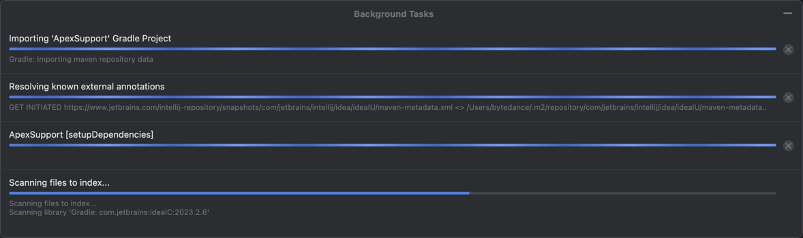

# WLKIdeaPlugin
Idea插件项目，个人兴趣


# 备注
## gradle-jvm的版本对应关系
来源于官网：
https://docs.gradle.org/current/userguide/compatibility.html#compatibility


## Java 字节码版本对应
官网链接：https://javaalmanac.io/bytecode/versions/

Class File Versions |  JDK Version | Bytecode Version
Java 1.0	45.0
Java 1.1	45.3
Java 1.2	46.0
Java 1.3	47.0
Java 1.4	48.0
Java 5	49.0
Java 6	50.0
Java 7	51.0
Java 8	52.0
Java 9	53.0
Java 10	54.0
Java 11	55.0
Java 12	56.0
Java 13	57.0
Java 14	58.0
Java 15	59.0
Java 16	60.0
Java 17	61.0
Java 18	62.0
Java 19	63.0
Java 20	64.0
Java 21	65.0
Java 22	66.0
Java 23	67.0
Java 24	68.0

# 注意事项
## gradle 的下载加速镜像
```
distributionUrl=https\://mirrors.cloud.tencent.com/gradle/gradle-8.3-all.zip
#distributionUrl=https\://mirrors.aliyun.com/gradle/distributions/v8.3.0/gradle-8.3-all.zip
```
一个腾讯的，一个阿里云的
## 新建插件类型的module
1、 在IDEA上，右键新建module时，选择IDE plugin类型后，一开始只有一个文件（xxxxx.iml)，，然后IDEA 会自动去下载好多文件，比较久
下载gradle、jbr等





